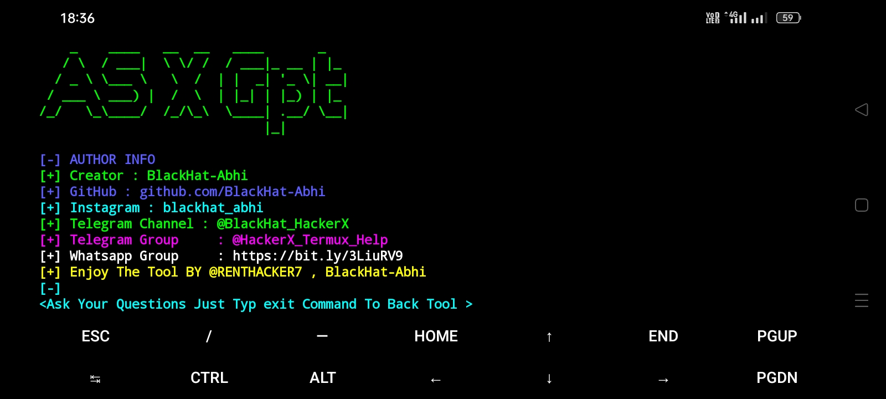
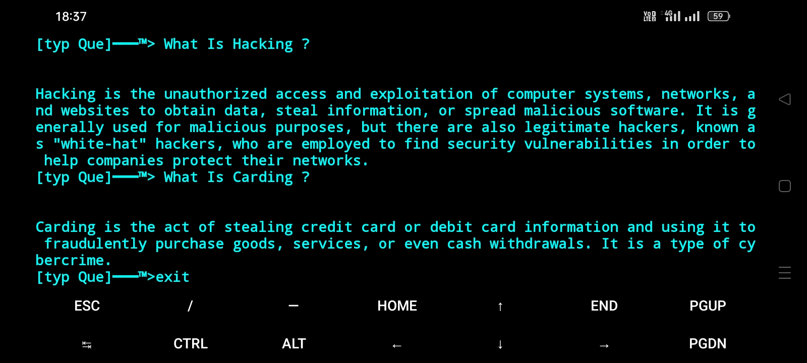
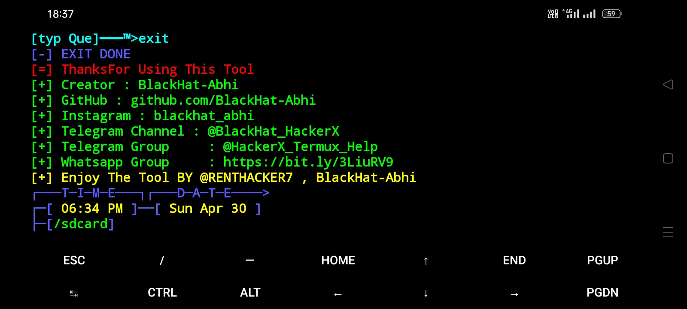

# AsXGpt

This Tool Allowed To Openai ChatGpt In Termux 

## Requirements

> Python3  

> openai module

# Tested On

**Termux**

# Working

**Termux**

## Installation ⬇️

`apt update && apt upgrade -y`

`apt install python -y`

`apt install git -y`

`apt install git -y`

`git clone https://github.com/BlackHat-Abhi/AsXGpt.git `

`cd AsXGpt `

`python asxgpt.py `

# Note

**To exit from tool just type `exit`  and hit ENTER. You will get exit from prompt.**

# Screenshots

### Telegram Channel : [Channel](https://t.me/BlackHat_HackerX)

#### Enjoy This Script BY Abhi !

## CONNECT WITH US :

  

